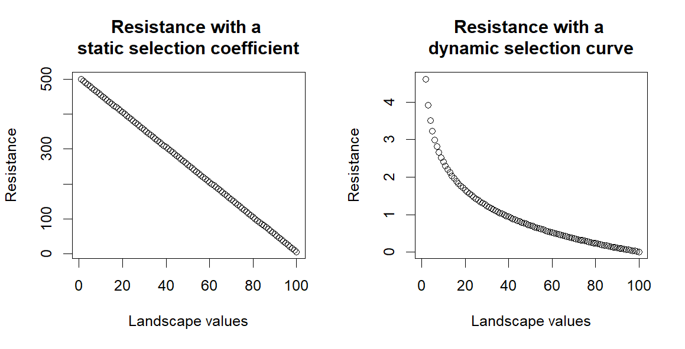
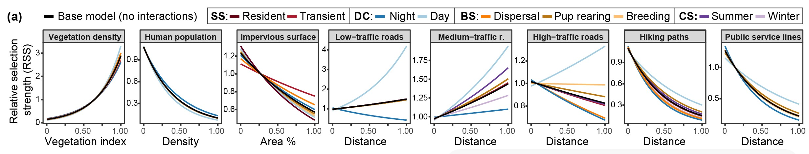

This code replicates the analysis published in https://esajournals.onlinelibrary.wiley.com/doi/full/10.1002/fee.2633 

The code here is used to estimate resistance values from a habitat selection analysis but with the novelty of using the relative selection strength (RSS) of each landscape component.

The main difference to previous attempts at using habitat selection analysis to estimate resistance is that here we use the relative selection strength for each landscape component, which generates a selection curve for each landscape component.- see Figure 2 a in the paper. Previous research instead have used either directly the selection coefficient given in the habitat selection analysis, or a relationship curve between this coefficient value and resistance, predefined by the researchers. 

Our method using RSS allows to integrate the natural variability in selection the animal shows for each component of the landscape included in the habitat selection analysis.

For example, if we have three cells with landscape value 1,2,3, and we use only the selection coefficient (i.e. 5) provided by the habitat selection analysis we will have a selection value of (5x1), (5x2), (5x3) across these cells and we could convert this to resistance either directly (5), (10), (15), a linear increase in resistance across the landscape values. Alternatively, if we use some kind of relationship predefined by a researcher, the relationship is either static across the range of values of all landscape components, or predetermined differently across landscape components, eitherway defined by a researcher, not the data.

Instead if we use the RSS, we use the relationship curve between selection and landscape variable specific to each landscape variable. 

For example, if the RSS shows an exponential growth in selection, as we saw with the vegetation index, we will have a selection strength of 1, 2, 10 for the cells with values 1, 2, 3. Therefore, selection values across those cells will be (1x1), (2x2), (10x3), i.e. 1, 4, 30. Representing better the stronger change in selection at higher vegetation values, than at lower vegetation values. If we transfer this on to resistance by flipping the curve, the resistance will stay stronger across lower vegetation values for longer as values increase and will rapidly decline passed a certain threshold, mirroring the relative selection curve of that specific landscape component. This allows for more variability when we are adding the contribution of the different landscape components. 

--------------------------------------------------

The repository includes scripts for:

- Cleaning GPS collar data, we do not provide the raw GPS data, as I have no ownership.
- Extracting steps from GPS data, random steps and extracting landscape information at each step. The repository include the final object from this code.
- Habitat selection analysis using GLMMTMB because it allows for the direct integration of random effects into the model structure. (Muff et al. 2020)
- Estimating Relative Selection Strength following Avgar et al, 2017, for each landscape variable and each model both without and with interactions (a, base model, b. dynamic model)
- Generating Cost surface maps, or resistance layers, from the Relative Selection Strength of each Landscape variable to be used in Connectivity analysis. 
- Estimating habitat suitability index from the Habitat Selection Analysis
- Extracting patches based on the habitat suitability index.
- The model specification process we followed in the paper
- Code to map movement for the identification of social status periods for each coyote 

If you apply the code provided here please cite the published paper. 

Don't hesitate to contact me if you are running into issues adapting any part of this code to your analysis. 

